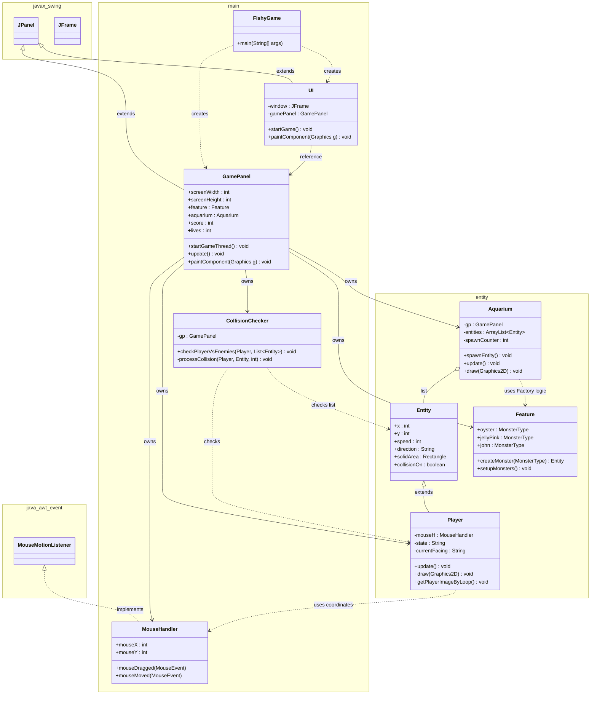

```mermaid
classDiagram
    %% --- PACKAGES & IMPORTS ---
    namespace main {
        class FishyGame
        class UI
        class GamePanel
        class MouseHandler
        class CollisionChecker
    }
    namespace entity {
        class Entity
        class Player
        class Aquarium
        class Feature
    }
    namespace java_awt_event {
        class MouseMotionListener
    }
    namespace javax_swing {
        class JPanel
        class JFrame
    }

    %% --- INHERITANCE (IS-A) ---
    JPanel <|-- GamePanel : extends
    JPanel <|-- UI : extends
    Entity <|-- Player : extends
    MouseMotionListener <|.. MouseHandler : implements

    %% --- ASSOCIATIONS (HAS-A / USES) ---
    FishyGame ..> UI : creates
    FishyGame ..> GamePanel : creates
    
    UI --> GamePanel : reference
    
    GamePanel --> MouseHandler : owns
    GamePanel --> Aquarium : owns
    GamePanel --> Feature : owns
    GamePanel --> Player : owns
    GamePanel --> CollisionChecker : owns

    %% Aquarium contains many Entities (Aggregation)
    Aquarium o-- Entity : list
    
    %% Dependencies
    Player ..> MouseHandler : uses coordinates
    Aquarium ..> Feature : uses Factory logic
    CollisionChecker ..> Player : checks
    CollisionChecker ..> Entity : checks list

    %% --- CLASS DETAILS ---
    class FishyGame {
        +main(String[] args)
    }

    class UI {
        -window : JFrame
        -gamePanel : GamePanel
        +startGame() void
        +paintComponent(Graphics g) void
    }

    class MouseHandler {
        +mouseX : int
        +mouseY : int
        +mouseDragged(MouseEvent)
        +mouseMoved(MouseEvent)
    }

    class GamePanel {
        +screenWidth : int
        +screenHeight : int
        +feature : Feature
        +aquarium : Aquarium
        +score : int
        +lives : int
        +startGameThread() void
        +update() void
        +paintComponent(Graphics g) void
    }

    class Feature {
        +oyster : MonsterType
        +jellyPink : MonsterType
        +john : MonsterType
        +createMonster(MonsterType) Entity
        +setupMonsters() void
    }

    class Aquarium {
        -gp : GamePanel
        -entities : ArrayList~Entity~
        -spawnCounter : int
        +spawnEntity() void
        +update() void
        +draw(Graphics2D) void
    }

    class Entity {
        +x : int
        +y : int
        +speed : int
        +direction : String
        +solidArea : Rectangle
        +collisionOn : boolean
    }

    class Player {
        -mouseH : MouseHandler
        -state : String
        -currentFacing : String
        +update() void
        +draw(Graphics2D) void
        +getPlayerImageByLoop() void
    }

    class CollisionChecker {
        -gp : GamePanel
        +checkPlayerVsEnemies(Player, List~Entity~) void
        -processCollision(Player, Entity, int) void
    }

    %% Notes
    %% Game flow: FishyGame -> UI -> GamePanel(loop) -> update/draw -> Player/Aquarium

```